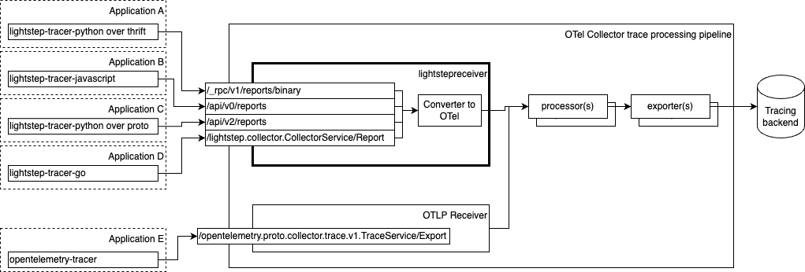

[](https://github.com/zalando/otelcol-lightstep-receiver/actions/workflows/build.yml)
[](https://opensource.org/licenses/MIT)

## OpenTelemetry Collector Lightstep Receiver

The `lightstepreceiver` receives OpenTracing traces from Lightstep tracers in various supported formats converting them into OpenTelemetry'a `ptrace.Traces` propagating it further in pipelines



### Supported formats and endpoints
- `/_rpc/v1/reports/binary` - Thrift binary over http, reported by [lightstep-tracer-python](https://github.com/lightstep/lightstep-tracer-python)
- `/api/v0/reports` - Thrift JSON over http, reported by [lightstep-tracer-javascript](https://github.com/lightstep/lightstep-tracer-javascript)
- `/api/v2/reports` - Protobuf over http, reported by [lightstep-tracer-python](https://github.com/lightstep/lightstep-tracer-python)
- `/lightstep.collector.CollectorService/Report` - Protobuf over grpc, reported by [lightstep-tracer-go](https://github.com/lightstep/lightstep-tracer-go) 
 

### Access token processing
Lightstep access token is extracted from the payload and propagated further by context item `lightstep-access-token`, for further using by a `headersetter` extension 

### Tracer metrics processing
Lighstep tracer reports various client side metrics as `client-drop-spans` via traces payload, these metrics are extracted and reported by collector standard metrics reporting pipeline and available for scraping as `lightstep_receiver_client_spans_dropped`

### Configuration

All that is required to enable the Lightstep receiver is to include it in the receiver definitions. A protocol can be disabled by simply not specifying it in the list of protocols.

```yaml
lightstepreceiver:
  protocols:
    pbgrpc:
    pbhttp:
    thrift:
```


### Advanced Configuration

Several helper files are leveraged to provide additional capabilities automatically:

- [gRPC settings](https://github.com/open-telemetry/opentelemetry-collector/blob/main/config/configgrpc/README.md) including CORS
- [HTTP settings](https://github.com/open-telemetry/opentelemetry-collector/blob/main/config/confighttp/README.md)
- [TLS and mTLS settings](https://github.com/open-telemetry/opentelemetry-collector/blob/main/config/configtls/README.md)
- [Auth settings](https://github.com/open-telemetry/opentelemetry-collector/blob/main/config/configauth/README.md)

### Debugging

1. Set a breakpoint where needed
2. Run collector in debug mode with (note that it will be compiled with debug symbols already) 
```
make debug
```
3. Connect with remote debugger from your beloved IDE
4. Generate some traces with your application
 
